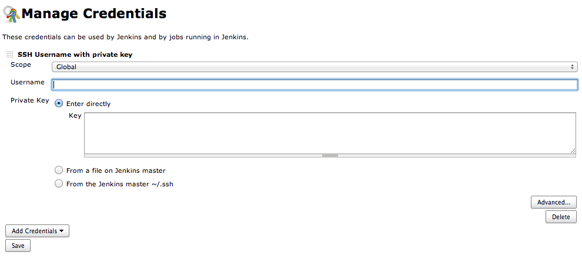

# SSH Agent Plugin

This plugin allows you to provide SSH credentials to builds via a
ssh-agent in Jenkins.

This is convenient in some cases.
Alternately, you can use the generic `withCredentials` step to bind an SSH private key to a temporary file
and then pass that to commands that require it,
for example using the `-i` option to `ssh` or `scp`.

# Requirements

You need to have the `ssh-agent` executable installed on the agent.

# Configuring

First you need to add some SSH Credentials to your instance:

Jenkins \| Manage Jenkins \| Manage Credentials



Note that only Private Key based credentials can be used.

Then configure your build to use the credentials:


And then your build will have those credentials available, e.g.


From a Pipeline job, use the `sshagent` step.

# Jenkinsfile

```
      steps {
          sshagent (credentials: ['ssh-credentials-id']) {
            sh '[ -d ~/.ssh ] || mkdir ~/.ssh && chmod 0700 ~/.ssh'
            sh 'echo "$(ssh-keyscan -t rsa,dsa example.com)" >> ~/.ssh/known_hosts'
            sh 'ssh user@example.com ...'
          }
      }
```

# Version History

For new versions, see [GitHub releases](https://github.com/jenkinsci/ssh-agent-plugin/releases).

For old versions, see the [old changelog](docs/old-changelog.md).
